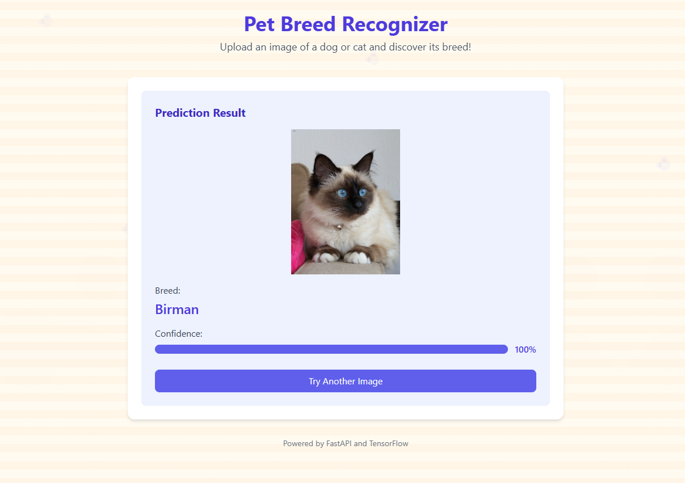

# 🐶🐱 PetClassifier - Klasyfikacja Ras Psów i Kotów  

🔍 Projekt wykorzystujący **Deep Learning** do klasyfikacji ras psów i kotów na podstawie zdjęć.  
🚀 Wykorzystuje **TensorFlow** i **Keras**, a dane są automatycznie sortowane i przetwarzane.  

## 🛠️ Pobieranie danych  

1️⃣ Pobierz dane z Kaggle:  
   - Link: [Oxford-IIIT Pet Dataset](https://www.kaggle.com/datasets/tanlikesmath/the-oxfordiiit-pet-dataset?resource=download)  
   - Umieść je w folderze: `model/data/`  

## 📚 Opis  

🐾 **PetClassifier** to projekt **Machine Learning**, który:  
✅ **Sortuje zdjęcia** psów i kotów do odpowiednich folderów 📂  
✅ **Trenuje model CNN** do klasyfikacji ras 🧠  
✅ **Umożliwia testowanie** nowych zdjęć w czasie rzeczywistym 📷  

🎯 Idealny do nauki **Deep Learningu** i analizy obrazów!  

---
## 🖼️ Zrzut ekranu


## ⚙️ Instalacja i uruchomienie  

1️⃣ **Sklonuj repozytorium**  
   ```bash
   git clone https://github.com/szymons3234/PetClassifier.git
   cd PetClassifier
   ```

2️⃣ **Zainstaluj wymagane biblioteki**  
   ```bash
   pip install -r requirements.txt
   ```

3️⃣ **Dodaj zdjęcia psów i kotów do folderu `model/data/`**  

4️⃣ **Uruchom notebook do sortowania plików**  
   - `model/Sorting.ipynb`  

5️⃣ **Uruchom notebook do trenowania modelu**  
   - `model/Recognizing_Dog_Cats.ipynb`  

6️⃣ **Uruchom serwer HTTP**  
   ```bash
   python -m http.server 3000
   ```

7️⃣ **Uruchom serwer API**  
   ```bash
   cd server
   uvicorn main:app --reload
   ```

🚀 Gotowe! Model rozpozna rasę psa lub kota 🐕🐈  

---

## 🖼️ Screenshot


## ⚙️ Technologie  

✅ **Python 3.8+**  
✅ **TensorFlow, Keras**  
✅ **Matplotlib, NumPy, PIL**  
✅ **FastAPI, Uvicorn**  

---

## 📁 Struktura katalogów  

```
PetClassifier/
├── model/
│   ├── model.keras           # Zapisany model
│   ├── Recognizing_Dog_Cats.ipynb  # Notebook do klasyfikacji
│   ├── Sorting.ipynb         # Notebook do sortowania
│   ├── data/                 # Surowe obrazy
│   ├── output_data/          # Przetworzone dane
├── server/
│   ├── main.py               # Serwer API
│   ├── model.keras           # Model używany przez API
├── UI/
│   ├── index.html            # Interfejs użytkownika
│   ├── css/
│   │   ├── styles.css        # Stylizacja strony
│   ├── js/
│   │   ├── script.js         # Obsługa interakcji
├── requirements.txt          # Lista wymaganych bibliotek
└── README.md                 # Dokumentacja projektu
```

---

## 🙏 Współpraca / Contribution  

💡 Masz pomysł? Dodaj **Pull Request** lub **Issue**!  
📧 Kontakt: [https://github.com/szymons3234]  

🌟 **Jeśli projekt Ci się podoba, zostaw ⭐ na GitHubie!**  

---

## 🐝 Licencja  
Projekt jest dostępny na licencji **MIT**. Możesz go używać i modyfikować dowolnie.  

---

# 🐶🐱 PetClassifier - Dog and Cat Breed Classification  

🔍 A **Deep Learning** project for classifying dog and cat breeds from images.  
🚀 Uses **TensorFlow** and **Keras**, with automated data sorting and preprocessing.  

## 🛠️ Downloading Data  

1️⃣ Download the dataset from Kaggle:  
   - Link: [Oxford-IIIT Pet Dataset](https://www.kaggle.com/datasets/tanlikesmath/the-oxfordiiit-pet-dataset?resource=download)  
   - Place it in: `model/data/`  

## 📚 Description  

🐾 **PetClassifier** is a **Machine Learning** project that:  
✅ **Sorts images** of dogs and cats into respective folders 📂  
✅ **Trains a CNN model** for breed classification 🧠  
✅ **Allows real-time image testing** 📷  

🎯 Perfect for learning **Deep Learning** and image analysis!  

---

## ⚙️ Installation & Running  

1️⃣ **Clone the repository**  
   ```bash
   git clone https://github.com/szymons3234/PetClassifier.git
   cd PetClassifier
   ```

2️⃣ **Install dependencies**  
   ```bash
   pip install -r requirements.txt
   ```

3️⃣ **Add dog and cat images to `model/data/`**  

4️⃣ **Run the sorting notebook**  
   - `model/Sorting.ipynb`  

5️⃣ **Run the training notebook**  
   - `model/Recognizing_Dog_Cats.ipynb`  

6️⃣ **Start HTTP server**  
   ```bash
   python -m http.server 3000
   ```

7️⃣ **Start API server**  
   ```bash
   cd server
   uvicorn main:app --reload
   ```

🚀 Done! The model will classify the dog or cat breed 🐕🐈  

---

## ⚙️ Technologies  

✅ **Python 3.8+**  
✅ **TensorFlow, Keras**  
✅ **Matplotlib, NumPy, PIL**  
✅ **FastAPI, Uvicorn**  

---

## 📁 Folder Structure  

```
PetClassifier/
├── model/
│   ├── model.keras           # Saved model
│   ├── Recognizing_Dog_Cats.ipynb  # Classification notebook
│   ├── Sorting.ipynb         # Sorting notebook
│   ├── data/                 # Raw images
│   ├── output_data/          # Processed data
├── server/
│   ├── main.py               # API server
│   ├── model.keras           # Model used by API
├── UI/
│   ├── index.html            # User interface
│   ├── css/
│   │   ├── styles.css        # Page styling
│   ├── js/
│   │   ├── script.js         # Interaction handling
├── requirements.txt          # Required libraries
└── README.md                 # Project documentation
```

---

## 🙏 Contributing  

💡 Have an idea? Submit a **Pull Request** or **Issue**!  
📧 Contact: [https://github.com/szymons3234]  

🌟 **If you like this project, leave a ⭐ on GitHub!**  

---

## 🐝 License  
This project is available under the **MIT** license. Feel free to use and modify it.  

